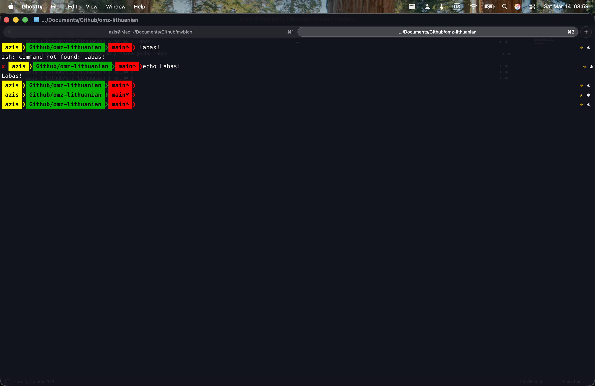
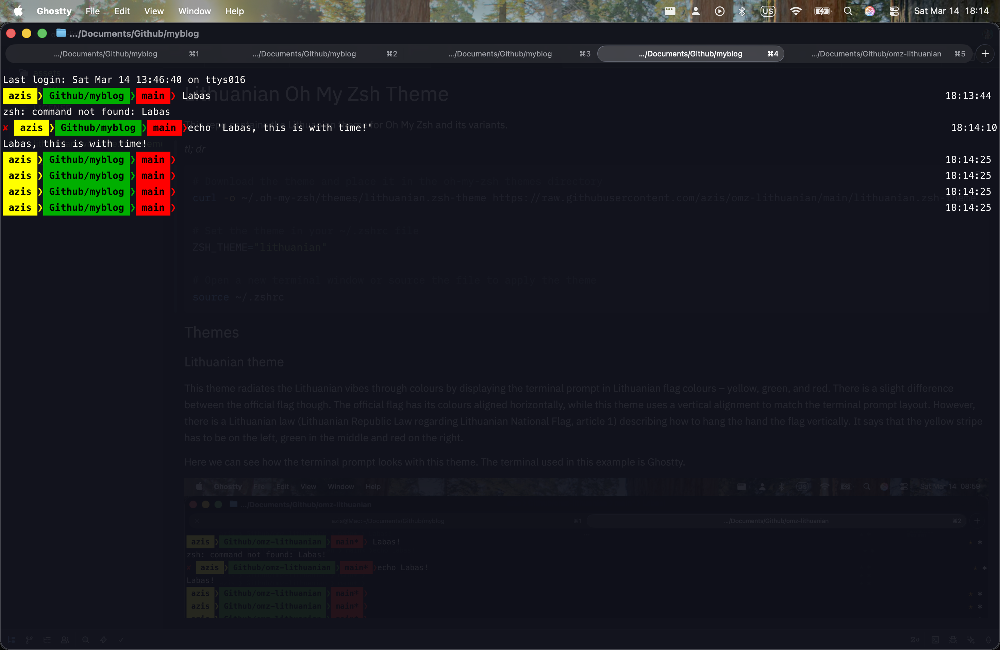

# Lithuanian Oh My Zsh Theme

This repo contains the Lithuanian theme for Oh My Zsh and its variants.

_tl; dr_

```bash
# Download the theme and place it in the oh-my-zsh themes directory
curl -o ~/.oh-my-zsh/themes/lithuanian.zsh-theme https://raw.githubusercontent.com/azis/omz-lithuanian/main/lithuanian.zsh-theme

# Set the theme in your ~/.zshrc file
ZSH_THEME="lithuanian"

# Open a new terminal window or source the file to apply the theme
source ~/.zshrc
```

## Themes

### Lithuanian theme

This theme radiates the Lithuanian vibes through colours by displaying the terminal prompt in Lithuanian flag colours -- yellow, green, and red. There is a slight difference between the official flag though. The official flag has its colours aligned horizontally, while this theme uses a vertical alignment to match the terminal prompt layout. However, there is a Lithuanian law (Lithuanian Republic Law regarding Lithuanian National Flag, article 1) describing how to hang the hand the flag vertically. It says that the yellow stripe has to be on the left, green in the middle and red on the right.

Here we can see how the terminal prompt looks with this theme. The terminal used in this example is Ghostty.



### Lithunian theme with time

It can also be useful to know the time of prompts in the terminal. Thus, here is the Lithuanian theme with time. This used to be my default theme. However, I have moved from it because of coding agents since copy-pasting errors from the terminal sends the time logs to the LLMs, too. The time logs complicate the prompts for the LLMs with a lot of noise, reducing the quality of the answer. This also eliminates the possibility of caching. I might go back to it once I find or create a tool that strips the time logs from the terminal output before sending it to the LLMs.

This is how it looks like.



## Setup

Theme setup is straightforward. We need to do two things:

1. Copy the theme file into your `~/.oh-my-zsh/custom/themes` directory
2. Set the theme in your `~/.zshrc` file:

### Copy the theme file

#### Option 1: Clone

1. Clone this repository:
```bash
git clone https://github.com/azis/omz-lithuanian.git 
```

2. cd into the repo and copy the theme file to your Oh My Zsh themes directory:
```bash
cd omz-lithuanian
cp lithuanian.zsh-theme ~/.oh-my-zsh/themes/
# or the version with time
cp lithuanian-withtime.zsh-theme ~/.oh-my-zsh/themes/
```

#### Option 2: Download

Download the theme file straight from Github
```bash
curl -o ~/.oh-my-zsh/themes/lithuanian.zsh-theme https://raw.githubusercontent.com/azis/omz-lithuanian/main/lithuanian.zsh-theme
# or the version with time
curl -o ~/.oh-my-zsh/themes/lithuanian-withtime.zsh-theme https://raw.githubusercontent.com/azis/omz-lithuanian/main/lithuanian-withtime.zsh-theme
```

### Set the theme

Add the following line to your `~/.zshrc` file:

```bash
ZSH_THEME="lithuanian"
# or
ZSH_THEME="lithuanian-withtime"
```

### Source zshrc

After making changes to your `~/.zshrc` file, source it to apply the changes or open a new terminal window.
```bash
source ~/.zshrc
```

## Sources

1. Lithuanian Republic law regarding Lithuanian national flag: https://lrk.lt/1-skirsnis-lietuvos-valstybe/15-straipsnis-valstybes-veliavos-spalvos-geltona-zalia-raudona
